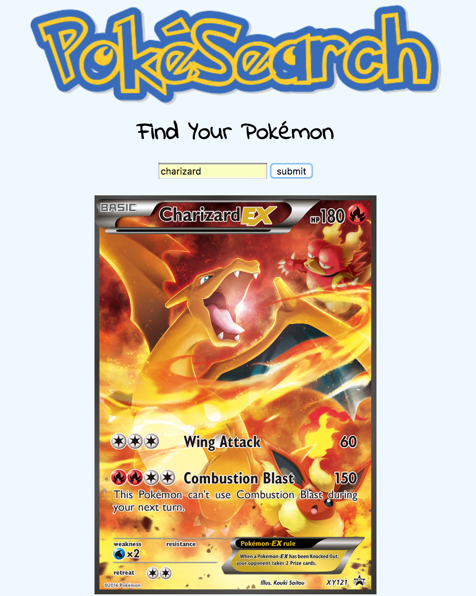

# PokéSearch
Got to find them all! Find your favorite Pokémon using this API.

**Link to project:** https://admiring-cray-e04cdb.netlify.com/

## How It's Made:

**Tech used:** HTML5, CSS3, JavaScript, and Pokémon API.

This project was written in JavaScript using the fetch method to access the Pokémon API. When a user enters the a pokémon name, the API returns a card displaying that pokémon. This project was designed using CSS3.

## Lessons Learned:

This project furthered my understanding of APIs.

## Related Projects:
Take a look at these projects that I have in my portfolio:

**NASA Photo of the Day API:** https://gallant-pasteur-e1c256.netlify.com/

**Music Database API:** https://zen-bose-c1b511.netlify.com/

**Cat Facts API:** https://peaceful-joliot-b4ac23.netlify.com/
